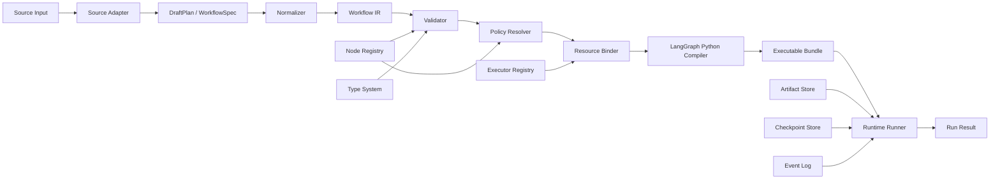
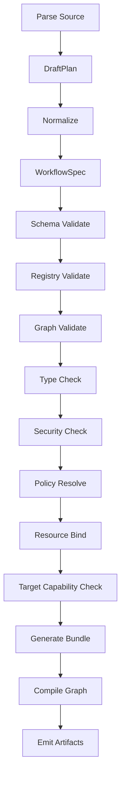
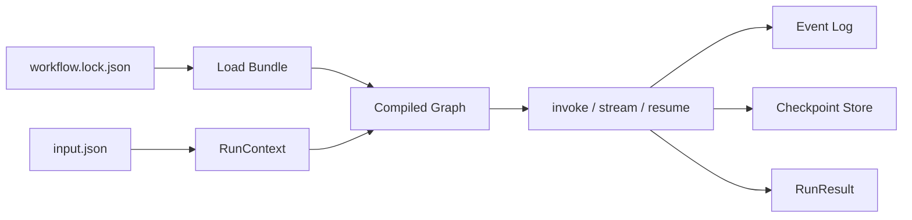

# prompt2langgraph 系统架构设计文档 v0.1

## 0. 文档说明

本文档在 `prompt2langgraph系统架构设计文档.md` 基础上修订，面向 v0.1 实现。它不覆盖原文档，而是给出更收敛的 MVP 架构基线。

当前项目代码目录 `prompt2langgraph/` 尚未建立源码，因此本文以新建 Python 包为前提。

## 1. 原架构文档评审结论

原架构文档的总体路线正确：采用“Source Adapters + Workflow IR + Validator + Resource Binder + LangGraph Backend + Runtime Runner”的分层设计，并把 LangGraph 作为首发后端。

需要改进的点：

1. 阶段切分需要更硬。v0.1 应先打通 `WorkflowIR/json_plan -> validate -> compile -> invoke`，再扩展 prompt 和 skill。
2. 模块职责需要避免重叠。Normalizer、Policy Injector、Resource Binder 的输入输出应更明确。
3. LangGraph lowering 规则需要写成强约束。尤其是 reducer、动态路由、`Command`、`Send`、interrupt/resume。
4. 运行时设计应先保持本地进程和 mock/builtin 执行器，不提前引入平台化复杂度。
5. 架构需要显式支持“拒绝执行”。诊断和失败路径是核心架构，不是附属功能。

v0.1 架构结论：

- 采用 Python 单包实现。
- LangGraph Python 是唯一执行后端。
- Workflow IR 是唯一事实来源。
- 编译器后端不调用 LLM。
- 所有不可信输入必须先进入 DraftPlan 或 Workflow IR，再经过校验。
- v0.1 优先本地运行，后续再扩展 HTTP API、多后端和平台化运行时。

## 2. 框架选择

按照项目需求，应选择 LangGraph 作为核心编排层。

原因：

- 需要显式控制 state、nodes、edges。
- 需要条件分支、循环、fan-out、join。
- 需要 checkpoint、interrupt 和 resume。
- 需要把结构化 IR lowering 为稳定图代码。

LangChain 的定位：

- 用作模型、工具、结构化输出和 LangChain tool 包装层。
- 不作为核心图编译层。

Deep Agents 的定位：

- 其 planning、skills、filesystem、subagent 思路值得借鉴。
- v0.1 不作为运行时，因为本项目目标是生成确定性 LangGraph 图。

参考项目落点：

| 项目 | 架构借鉴 |
|---|---|
| LangGraph | 图后端、state、edge、Command、Send、interrupt |
| PlanCompiler | 注册表、静态校验、确定性编译 |
| LLMCompiler | 编号计划、依赖引用、并行识别 |
| dify-workflow-dsl-skill | DSL 显式节点/边、导入前验证 |
| skills-to-dify-workflow | skill 目录读取和安全审查 |

## 3. 总体架构



核心数据流：

1. Source Adapter 把输入变成 `DraftPlan` 或 `WorkflowSpec`。
2. Normalizer 把 `DraftPlan` 规范化为 `WorkflowSpec`。
3. Validator 确认 IR 结构、类型、控制流和安全策略合法。
4. Policy Resolver 合并系统默认、注册表默认和用户选项。
5. Resource Binder 绑定执行器、模型、工具和 secrets 引用。
6. Compiler 生成 LangGraph Python bundle。
7. Runner 加载 bundle 并执行 `invoke`、`stream` 或 `resume`。

## 4. 推荐目录结构

```text
prompt2langgraph/
├── pyproject.toml
├── README.md
├── src/
│   └── prompt2langgraph/
│       ├── __init__.py
│       ├── cli.py
│       ├── adapters/
│       │   ├── base.py
│       │   ├── json_plan.py
│       │   ├── ir.py
│       │   ├── text_plan.py
│       │   └── skill_dir.py
│       ├── ir/
│       │   ├── models.py
│       │   ├── schema.py
│       │   ├── normalize.py
│       │   └── lockfile.py
│       ├── registry/
│       │   ├── nodes.py
│       │   ├── executors.py
│       │   └── builtins.py
│       ├── validate/
│       │   ├── validator.py
│       │   ├── graphcheck.py
│       │   ├── typecheck.py
│       │   └── security.py
│       ├── policy/
│       │   └── resolver.py
│       ├── binding/
│       │   └── binder.py
│       ├── compiler/
│       │   ├── base.py
│       │   └── langgraph_py.py
│       ├── runtime/
│       │   ├── runner.py
│       │   ├── events.py
│       │   ├── artifacts.py
│       │   └── checkpoints.py
│       ├── visualization/
│       │   └── mermaid.py
│       └── diagnostics/
│           ├── codes.py
│           └── report.py
├── examples/
│   ├── linear_research/
│   ├── conditional_human_gate/
│   ├── fanout_map_reduce/
│   └── invalid/
└── tests/
    ├── fixtures/
    ├── test_ir_schema.py
    ├── test_validator.py
    ├── test_langgraph_compiler.py
    ├── test_runner.py
    └── test_cli.py
```

## 5. 核心对象模型

### 5.1 WorkflowSpec

```python
class WorkflowSpec(BaseModel):
    schema_version: str
    workflow_id: str
    name: str
    description: str | None = None
    entrypoint: str
    state_schema: StateSchema
    nodes: list[NodeSpec]
    edges: list[EdgeSpec]
    policies: PolicySpec = Field(default_factory=PolicySpec)
    metadata: dict[str, Any] = Field(default_factory=dict)
```

设计约束：

- `workflow_id` 参与 lock hash。
- `metadata` 不影响执行语义。
- `nodes` 和 `edges` 规范化后稳定排序。
- 不允许保存密钥和任意代码。

### 5.2 StateSchema

```python
class StateSchema(BaseModel):
    input: dict[str, TypeSpec] = Field(default_factory=dict)
    output: dict[str, TypeSpec] = Field(default_factory=dict)
    channels: dict[str, TypeSpec] = Field(default_factory=dict)
    private: dict[str, TypeSpec] = Field(default_factory=dict)
    reducers: dict[str, ReducerSpec] = Field(default_factory=dict)
```

规则：

- 所有 node inputs/outputs 必须引用已声明 state key，或声明为局部参数。
- `array`、`messages`、fan-out 聚合字段必须声明 reducer。
- 大对象使用 `artifact_ref`，不直接进入 state。

### 5.3 NodeSpec

```python
class NodeSpec(BaseModel):
    id: str
    kind: str
    title: str | None = None
    executor: ExecutorRef
    inputs: dict[str, StateSelector] = Field(default_factory=dict)
    outputs: dict[str, StateSelector] = Field(default_factory=dict)
    params: dict[str, Any] = Field(default_factory=dict)
    retry: RetryPolicy | None = None
    timeout_s: int | None = None
    security: SecurityPolicy | None = None
```

规则：

- `kind` 必须来自 Node Registry。
- `executor` 必须能在 Binder 中解析。
- `params` 必须满足节点和执行器 schema。
- `side_effect` 节点必须带审批或幂等策略。

### 5.4 EdgeSpec

```python
class EdgeSpec(BaseModel):
    id: str
    source: str
    target: str
    kind: Literal["linear", "conditional", "loop", "fanout", "join"]
    condition: ConditionSpec | None = None
    map: MapSpec | None = None
    loop_guard: LoopGuard | None = None
```

规则：

- `linear` 编译为 `add_edge`。
- `conditional` 编译为 `add_conditional_edges` 或节点返回 `Command`。
- `loop` 必须有 `loop_guard.max_iterations`。
- `fanout` 必须声明 map 输入和 reduce 输出。
- 一个节点如果使用动态路由，不能再从同一节点声明普通静态边。

## 6. 编译管线



阶段职责：

| 阶段 | 输入 | 输出 | 是否允许 LLM |
|---|---|---|---|
| Parse | source | `WorkflowSpec` 或简化 JSON plan | 否；当前 release baseline 不包含 `prompt_text`/`plan_text` 适配器 |
| Normalize | `WorkflowSpec` 或简化 JSON plan | `WorkflowSpec` | 否 |
| Validate | `WorkflowSpec` | `ValidationReport` | 否 |
| Policy Resolve | `WorkflowSpec` | `ResolvedWorkflow` | 否 |
| Bind | `ResolvedWorkflow` | `BoundWorkflow` | 否 |
| Compile | `BoundWorkflow` | `ExecutableBundle` | 否 |
| Run | `ExecutableBundle` | `RunResult` | 否 |

## 7. Source Adapters

v0.1 已落地轻量 `SourceAdapter` 抽象，当前 CLI 通过 `IRAdapter` 或 `JSONPlanAdapter` 把已加载的 JSON object 转为 `WorkflowSpec`。诊断会保留 source 文件路径，并在 schema/parse 层尽量保留 JSON path。完整 YAML 读取、token/行列级 source map、以及独立的 source path 索引属于后续 P1，不作为 v0.1 release-blocking 范围。

### 7.1 IRAdapter

直接读取 Workflow IR。

职责：

- 读取已加载的 JSON object。
- 调用 Pydantic schema。
- 将 Pydantic schema error 映射为带 source 与 JSON path 的诊断。

### 7.2 JsonPlanAdapter

读取简化 JSON plan。

职责：

- 规范化字段名，如 `from`/`source`、`to`/`target`。
- 补齐默认 state channels。
- 生成 `WorkflowSpec`。
- 对缺失字段、非 object node/edge、无法推断 entrypoint 等 parse error 保留 source 与 JSON path。

### 7.3 TextPlanAdapter

后续 P1 候选能力；当前 release baseline 未实现 `plan_text` 适配器。

借鉴 LLMCompiler：

```text
1. search_docs(query)
2. summarize($1)
3. join()
```

职责：

- 解析编号步骤。
- 解析 `$1`、`$step_id` 依赖。
- 对不明确条件输出诊断。

### 7.4 SkillDirAdapter

v0.1 作为 P1。

v0.1 的 skill_dir 能力是静态预分析：读取 `SKILL.md` frontmatter、编号步骤、资源文件和风险词，输出分析对象和 draft nodes。v0.1 不从 skill_dir 生成可执行 `WorkflowSpec`，不执行 skill 脚本，也不隐式调用 shell 或网络。

职责：

- 读取 `SKILL.md`。
- 枚举 `scripts/`、`references/`、`assets/`。
- 抽取显式步骤。
- 进行安全扫描。
- 不执行脚本。

## 8. Registry 架构

### 8.1 Node Registry

Node Registry 是 Planner、Validator、Compiler 共享的事实来源。

```python
class NodeDefinition(BaseModel):
    kind: str
    description: str
    input_schema: dict[str, TypeSpec]
    output_schema: dict[str, TypeSpec]
    param_schema: dict[str, TypeSpec]
    planner_enabled: bool = True
    deprecated: bool = False
    side_effect: bool = False
    required_capabilities: list[str] = Field(default_factory=list)
    default_retry: RetryPolicy | None = None
    default_timeout_s: int | None = None
```

借鉴 PlanCompiler 的关键约束：

- LLM 只能选择注册表节点。
- 未注册节点直接失败。
- 参数契约在编译前检查。
- 结构无效不进入运行。

### 8.2 Executor Registry

Executor Registry 负责从抽象引用找到真实执行函数。

```python
class ExecutorDefinition(BaseModel):
    ref: str
    type: Literal["builtin", "python_callable", "langchain_tool", "llm", "human"]
    input_schema: dict[str, TypeSpec]
    output_schema: dict[str, TypeSpec]
    secrets: list[SecretRef] = Field(default_factory=list)
    capabilities: list[str] = Field(default_factory=list)
```

Binder 输出 secret-free 绑定摘要，只记录 executor ref、type 和 required capabilities；v0.1 产物不保存真实 secret，也不保存 secret 名称。

v0.1 执行边界：Executor Registry 可以表达 `builtin`、`python_callable`、`langchain_tool`、`llm`、`human` 类型，但 v0.1 内置 runner 只执行已注册的 deterministic builtin executor。非 builtin executor type 在 v0.1 中属于绑定/治理契约，不代表 runner 会隐式调用外部 LLM、网络服务、shell 命令或任意 Python callable。

## 9. Validator 架构

Validator 分层：

```text
SchemaValidator
-> RegistryValidator
-> GraphValidator
-> TypeChecker
-> SecurityValidator
-> TargetCapabilityValidator
```

### 9.1 GraphValidator

检查：

- 节点 ID 唯一。
- 边引用存在。
- entrypoint 存在。
- 所有节点从 entrypoint 可达。
- 至少一条路径通向 END。
- loop 有 guard。
- 动态路由节点无静态边冲突。

### 9.2 TypeChecker

检查：

- 节点输入 state key 存在。
- 节点输出 state key 存在。
- 上游输出类型兼容下游输入。
- executor 参数满足 schema。
- fan-out reduce 目标有 reducer。

### 9.3 SecurityValidator

检查：

- 未注册工具。
- 未授权 capability。
- 高风险 side effect。
- 任意 shell 或动态 Python。
- skill scripts 自动执行风险。
- secret 泄漏到 IR、lock、日志。

## 10. Policy Resolver

策略来源：

1. 系统默认策略。
2. NodeDefinition 默认策略。
3. ExecutorDefinition 默认策略。
4. WorkflowSpec policies。
5. CompileOptions。

优先级：

```text
CompileOptions > WorkflowSpec > ExecutorDefinition > NodeDefinition > SystemDefault
```

v0.1 默认策略：

- 节点默认超时 60 秒。
- LLM 节点默认超时 120 秒。
- tool 节点默认重试 1 次。
- side_effect 默认要求 human approval。
- loop 默认最大 10 次，除非显式设置更小或更大且被允许。

v0.1 policy/binding boundary：当前 release-blocking 范围只要求 deterministic policy summary、executor binding summary、capability 名称摘要和 secret-free artifact。真实 secret ref 存在性校验、未授权 capability 拒绝、provider/model/tool 可用性检查和 `CompileOptions` Pydantic 模型属于后续 P1/P2 工作，不能作为 v0.1 runner 隐式执行外部资源的依据。

## 11. Resource Binder

Binder 输入 `ResolvedWorkflow`，输出 `BoundWorkflow`。

职责：

- 查找 executor。
- 生成 manifest 和 compile report 中的 executor 绑定摘要。
- 记录 executor required capabilities 名称。
- 后续 P1/P2 再校验 provider/model/tool 可用性和 secret ref 存在性。
- 不读取或输出真实 secret。

绑定示例：

```json
{
  "node_id": "answer",
  "executor": "model.answerer",
  "binding": {
    "type": "llm",
    "provider": "openai-compatible",
    "model": "configured-at-runtime",
    "secret_ref": "env:OPENAI_API_KEY"
  }
}
```

## 12. LangGraph Python Compiler

### 12.1 生成物

```text
generated/
├── state.py
├── nodes.py
└── graph.py
```

- `state.py` 定义 state schema 和 reducers。
- `nodes.py` 定义 node wrappers。
- `graph.py` 定义 `build_graph()` 和 `compile_graph()`。

### 12.2 State lowering

IR 到 LangGraph state：

- `string` -> `str`
- `number` -> `float`
- `integer` -> `int`
- `boolean` -> `bool`
- `object` -> `dict[str, Any]`
- `array` -> `list[Any]`
- `messages` -> `Annotated[list, add_messages]`
- `artifact_ref` -> `ArtifactRef`

带 reducer 的字段使用 `typing.Annotated`。

### 12.3 Node lowering

节点 wrapper 规则：

- 输入为完整 state。
- 从 state 中提取声明的 inputs。
- 调用 bound executor。
- 校验 executor 输出。
- 返回 partial state update。
- 不原地修改 state 后返回完整 state。

### 12.4 Edge lowering

| IR edge | LangGraph lowering |
|---|---|
| `linear` | `builder.add_edge(source, target)` |
| `conditional` | `builder.add_conditional_edges(source, router, mapping)` |
| `loop` | 条件路由回到循环入口，并检查 counter |
| `fanout` | 条件路由返回 `list[Send]` |
| `join` | v0.1 不 lowering；仅 IR/registry/Mermaid 可见，target compile 返回诊断 |

v0.1 target capability：`linear`、`conditional`、`loop`、`fanout` 是 `langgraph-py` runner/compiler 的可执行 edge kind；`join` 可存在于 IR、registry 和 Mermaid 中，但 v0.1 runner/compiler 必须返回 target capability 诊断，不生成可执行 bundle。

关键约束：

- 如果节点返回 `Command(goto=...)`，同一节点不得再有静态出边。
- 如果只需要路由，不更新 state，优先用 `add_conditional_edges`。
- 如果需要更新 state 并跳转，使用 `Command`。
- `Command(resume=...)` 只用于恢复 interrupt，不用于普通继续对话。

### 12.5 Human gate

`human_gate` 编译为调用 `interrupt()` 的节点。

运行时首次进入节点：

- 抛出 interrupt。
- Runner 返回 waiting 状态。
- checkpoint 保存线程状态。

恢复时：

- Runner 使用 `Command(resume=approval_payload)`。
- 必须使用同一 `thread_id`。

## 13. Runtime Runner

v0.1 Runner 是本地进程内运行器。



### 13.1 RunContext

```python
class RunContext(BaseModel):
    run_id: str
    thread_id: str
    workflow_id: str
    compile_id: str
    user_id: str | None = None
    config: dict[str, Any] = Field(default_factory=dict)
```

### 13.2 Checkpoint

v0.1 支持：

- 默认内存 checkpointer。
- 可选 SQLite checkpointer。

后续支持 PostgreSQL。

### 13.3 Event Log

事件类型：

- `run.started`
- `node.started`
- `node.finished`
- `node.failed`
- `node.interrupted`
- `run.resumed`
- `run.finished`
- `run.failed`

## 14. 编译产物

v0.1 bundle 的目标是可复现、可校验、可由当前 `prompt2langgraph` 库加载运行；不是完全脱离库执行的静态 LangGraph 源码包。`generated/*.py` 是导入入口和元数据薄封装，运行时仍以 `workflow.ir.json` 为事实来源，并调用库内 `compile_workflow_to_graph()` 构建 LangGraph 图。若后续目标升级为可审计静态代码，需要新增完整 graph builder 生成器，并把 `generated/*.py` 输出纳入独立 golden 快照。

### 14.1 workflow.lock.json

包含：

- `schema_version`
- `workflow_id`
- `workflow_hash`
- `registry_hash`
- `target`
- `langgraph_version`
- `prompt2langgraph_version`
- `compile_options_hash`
- `policy_hash`
- `generated_files`

不包含：

- API key。
- 数据库密码。
- 用户输入全文。
- 大型运行产物。

### 14.2 manifest.json

包含：

- 图入口。
- 节点列表。
- 边列表。
- state schema。
- executor binding 摘要。
- interrupt 节点。
- side_effect 节点。
- artifact policy。

### 14.3 compile_report.json

包含：

- 编译阶段耗时。
- warning。
- error。
- 规范化前后摘要。
- 生成文件清单。

## 15. CLI 架构

命令：

```bash
pt2lg validate workflow.json
pt2lg compile workflow.json --target langgraph-py --out build/
pt2lg run build/workflow.lock.json --input input.json
pt2lg resume build/workflow.lock.json --thread-id <id> --resume approval.json
pt2lg graph build/workflow.lock.json --format mermaid
```

实现建议：

- 使用 Typer 或 Click。
- 所有命令支持 `--json`。
- 错误写 stderr。
- 机器可读报告写 stdout 或文件。

## 16. API 架构

v0.1 Python API：

```python
def validate_workflow(workflow: WorkflowSpec) -> ValidationReport: pass

def compile_workflow(
    source: WorkflowSpec | SourceInput,
    options: CompileOptions | None = None,
) -> CompileResult: pass

def run_workflow(
    bundle: ExecutableBundle | str,
    input_payload: dict,
    options: RunOptions | None = None,
) -> RunResult: pass
```

后续 HTTP API 不进入 v0.1。

## 17. 测试架构

测试分层：

| 层级 | 测试内容 |
|---|---|
| 单元测试 | IR、错误码、lock hash、Mermaid |
| 校验测试 | 节点、边、类型、循环、安全 |
| 编译测试 | 生成 LangGraph 图可 compile |
| 运行测试 | mock executor 可 invoke |
| 中断测试 | human_gate 可 interrupt/resume |
| 快照测试 | lock、manifest、Mermaid 稳定 |
| CLI 测试 | 命令退出码和 JSON 输出 |

核心 fixtures：

- `linear_llm.json`
- `linear_retriever_llm.json`
- `conditional_human_gate.json`
- `loop_with_guard.json`
- `fanout_map_reduce.json`
- `invalid_unknown_node.json`
- `invalid_type_mismatch.json`
- `invalid_loop_without_guard.json`
- `invalid_route_conflict.json`
- `skill_basic/`

## 18. 安全边界

信任级别：

```text
source text: 不可信
LLM draft plan: 不可信
Workflow IR before validation: 不可信
Workflow IR after validation: 结构可信，资源未绑定
BoundWorkflow: 可编译，未运行
ExecutableBundle: 可运行，仍需 runtime policy
RunResult: 需审计
```

默认禁止：

- 未注册工具。
- 未注册 executor。
- skill script 自动执行。
- 任意 shell。
- 动态 Python eval/exec。
- secret 写入产物。
- side_effect 无审批执行。

## 19. 与参考项目的实现映射

### 19.1 PlanCompiler -> Registry 和 Validator

采用：

- 固定节点库。
- 参数 schema。
- 类型检查。
- 无效计划拒绝执行。

调整：

- PlanCompiler 强 DAG，prompt2langgraph 允许 LangGraph 循环。
- 循环必须有 `loop_guard` 和 `max_iterations`。

### 19.2 LLMCompiler -> Text Plan 和并行识别

采用：

- 编号任务。
- `$id` 依赖引用。
- join。
- 可并行任务识别。

v0.1 不采用：

- 流式 planner。
- 动态 replan。

### 19.3 Dify DSL -> 显式图和导入前验证

采用：

- 节点和边显式表示。
- 稳定字符串 ID。
- provider/tool 字段完整性检查。
- 本地 validator 先于导入或运行。

### 19.4 LangGraph -> 后端语义

采用：

- `StateGraph`
- `START` / `END`
- reducer
- `add_edge`
- `add_conditional_edges`
- `Send`
- `Command`
- `interrupt`
- checkpointer

## 20. 演进路线

### v0.1：确定性最小闭环

- IR。
- 注册表。
- Validator。
- LangGraph Python compiler。
- 本地 runner。
- JSON plan。
- golden tests。

### v0.2：Plan 和 Skill 前端

- `plan_text` 稳定解析。
- `skill_dir` 更强抽取。
- prompt planner。
- LLM structured output。

### v0.3：运行时增强

- SQLite/PostgreSQL checkpointer。
- stream events。
- artifact store。
- 更完整 resume API。

### v0.4：多后端和平台化

- LangGraph.js。
- Dify YAML。
- HTTP API。
- Web UI。
- 插件市场。

## 21. v0.1 最短实现路径

推荐顺序：

1. 建立包结构和 CLI 空壳。
2. 实现 IR Pydantic 模型。
3. 实现 Node/Executor Registry。
4. 实现 Validator 和 TypeChecker。
5. 实现 lock/manifest/report。
6. 实现 LangGraph Python compiler。
7. 用 builtin mock executor 打通 compile/invoke。
8. 增加条件边、循环、fan-out。
9. 增加 human_gate interrupt/resume。
10. 增加 JsonPlanAdapter。
11. 增加 SkillDirAdapter 预分析。
12. 补齐测试和 examples。

这个顺序最先证明核心价值：被校验的结构化计划可以稳定编译为可运行 LangGraph 图。
