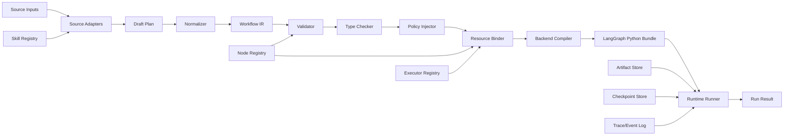
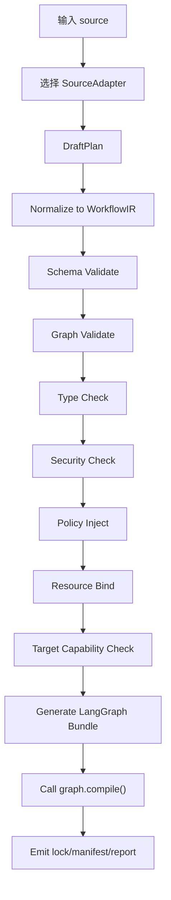
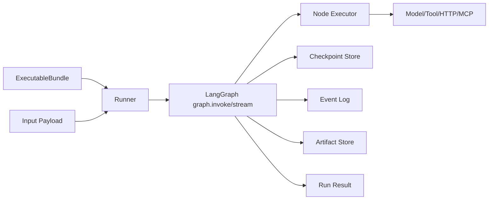

# prompt2langgraph 系统架构设计文档

## 1. 架构结论

prompt2langgraph 应采用“编译器前端【？】 + Workflow IR + LangGraph 后端 + 运行时控制器【？】”的分层架构。框架选择结论如下：

- 主运行目标选择 LangGraph，因为本项目需要显式控制状态、节点、边、条件分支、循环、并行 fan-out【？】、人工中断和恢复。
- LangChain 可作为模型、工具、结构化输出和工具封装层，但不应替代底层图编译。
- Deep Agents 的技能、文件、任务规划能力值得借鉴，但本项目核心目标是生成确定性 LangGraph 图，因此不把 Deep Agents 作为首发运行时。
- PlanCompiler 的注册表和静态校验模式应作为编译器核心设计参考。
- LLMCompiler 的编号计划、依赖引用、并行调度和 replan 思路应作为 prompt/plan 前端设计参考。
- skills-to-dify-workflow 和 dify-workflow-dsl-skill 的 skill 解析、安全审查、节点/边 DSL 思路应作为 skill 前端设计参考。

## 2. 总体架构



系统分为八个核心层：

1. Source Adapters：接收 prompt、skill、plan、IR。
2. Draft Plan：保存未完全可信的候选计划。
3. Normalizer：把候选计划规范化为 Workflow IR。
4. Workflow IR：唯一事实来源。
5. Validator / Type Checker / Policy Injector【？】：静态分析与安全治理。
6. Resource Binder：绑定模型、工具、MCP、HTTP【？】、Python callable。
7. Backend Compiler：生成 LangGraph 代码、bundle 和 lock。
8. Runtime Runner：执行、恢复、记录、观测。

## 3. 推荐目录结构

当前 `prompt2langgraph/` 目录还没有源码，建议后续建立如下结构：

```text
prompt2langgraph/
├── pyproject.toml
├── README.md
├── src/
│   └── prompt2langgraph/
│       ├── __init__.py
│       ├── cli.py
│       ├── adapters/
│       │   ├── base.py
│       │   ├── json_plan.py
│       │   ├── text_plan.py
│       │   ├── prompt_planner.py
│       │   └── skill_dir.py
│       ├── ir/
│       │   ├── models.py
│       │   ├── schema.py
│       │   ├── normalize.py
│       │   └── lockfile.py
│       ├── registry/
│       │   ├── nodes.py
│       │   ├── executors.py
│       │   └── builtins.py
│       ├── validate/
│       │   ├── validator.py
│       │   ├── typecheck.py
│       │   ├── graphcheck.py
│       │   └── security.py
│       ├── compiler/
│       │   ├── base.py
│       │   └── langgraph_py.py
│       ├── runtime/
│       │   ├── runner.py
│       │   ├── events.py
│       │   ├── artifacts.py
│       │   └── checkpoints.py
│       ├── visualization/
│       │   └── mermaid.py
│       └── diagnostics/
│           ├── errors.py
│           └── report.py
├── examples/
│   ├── linear_research/
│   ├── conditional_approval/
│   └── skill_compile/
└── tests/
    ├── fixtures/
    ├── test_ir_schema.py
    ├── test_validator.py
    ├── test_langgraph_compiler.py
    └── test_e2e.py
```

## 4. 模块设计

### 4.1 Source Adapters

职责：

- 读取不同来源输入。
- 生成 `DraftPlan`。
- 保留源位置信息，便于错误定位。
- 不执行任何业务逻辑或脚本。

适配器：

| 适配器 | 输入 | 输出 |
|---|---|---|
| `JsonPlanAdapter` | JSON/YAML plan | `DraftPlan` |
| `TextPlanAdapter` | 编号文本计划 | `DraftPlan` |
| `PromptPlannerAdapter` | 用户 prompt | `DraftPlan` |
| `SkillDirAdapter` | skill 目录 | `DraftPlan` |
| `IRAdapter` | Workflow IR | `WorkflowSpec` |

`TextPlanAdapter` 可借鉴 LLMCompiler 的规则：

```text
1. search("keyword")
2. summarize("$1")
3. join()
```

其中 `$1`、`${1}` 表示依赖引用，解析器据此推断边。

`SkillDirAdapter` 可借鉴 skills-to-dify-workflow：

- 读取 `SKILL.md`。
- 枚举 `scripts/`、`references/`、`assets/`。
- 识别 LLM 步骤、工具步骤、分支、循环、并行。
- 生成安全扫描结果。【不做】

### 4.2 Workflow IR

IR 是系统的核心契约。所有输入必须先降为 IR，后端编译器只能消费 IR。

推荐模型：

```python
class WorkflowSpec(BaseModel):
    schema_version: str
    workflow_id: str
    name: str
    description: str | None = None
    entrypoint: str
    state_schema: StateSchema
    nodes: list[NodeSpec]
    edges: list[EdgeSpec]
    policies: PolicySpec = PolicySpec()【？】
    metadata: dict[str, Any] = {}
```

```python
class StateSchema(BaseModel):
    input: dict[str, TypeSpec]
    output: dict[str, TypeSpec]
    channels【？】: dict[str, TypeSpec]
    private: dict[str, TypeSpec] = {}
    reducers: dict[str, ReducerSpec] = {}
```

```python
class NodeSpec(BaseModel):
    id: str
    kind: str
    title: str | None = None
    executor: ExecutorRef
    inputs: dict[str, StateSelector] = {}
    outputs: dict[str, StateSelector] = {}
    params: dict[str, Any] = {}
    retry: RetryPolicy | None = None
    timeout_s: int | None = None
    resources: ResourcePolicy | None = None
    security: SecurityPolicy | None = None
```

```python
class EdgeSpec(BaseModel):
    id: str
    source: str
    target: str
    kind: Literal["linear", "conditional", "loop", "fanout", "join"]
    condition: ConditionSpec | None = None
    map: MapSpec | None = None
    loop_guard: LoopGuard | None = None
```

设计原则：

- IR 必须可 JSON 序列化。
- IR 中不保存密钥。
- IR 中不保存任意 Python 代码。
- 所有引用使用稳定 ID。
- 所有非确定字段必须进入 metadata，不参与 lock 哈希。

### 4.3 Node Registry

节点注册表是 Planner 和 Validator 的共同事实来源。借鉴 PlanCompiler，LLM 只能选择注册表中允许的节点。

注册项示例：

```python
class NodeDefinition(BaseModel):
    kind: str
    description: str
    input_schema: dict[str, TypeSpec]
    output_schema: dict[str, TypeSpec]
    param_schema: dict[str, TypeSpec]
    planner_enabled: bool = True
    deprecated: bool = False
    side_effect: bool = False
    required_capabilities: list[str] = []
    default_retry: RetryPolicy | None = None
```

内置节点：

| kind | 作用 |
|---|---|
| `llm` | 调用模型生成结构化输出 |
| `tool` | 调用注册工具 |
| `router` | 根据 state 条件选择下一条边 |
| `retriever` | 检索文档或知识库 |
| `transform` | 数据转换 |
| `human_gate` | 人工审批和 LangGraph interrupt |
| `subgraph` | 调用另一个编译图 |
| `side_effect` | 外部写操作 |
| `join` | 分支汇聚 |

### 4.4 Executor Registry

执行器注册表负责把节点绑定到真实实现。

执行器类型：

- `builtin`：内置函数。
- `python`：Python callable。【？】
- `langchain_tool`：LangChain tool。
- `mcp_tool`：MCP 工具。
- `http`：HTTP endpoint。【？】
- `llm`：模型调用。
- `subgraph`：已编译 LangGraph 子图。
- `human`：人工输入。

绑定阶段必须检查：

- 执行器是否存在。
- 输入参数 schema 是否匹配。
- secrets 是否可用。
- 权限是否满足。
- 是否允许在当前编译目标中运行。

### 4.5 Validator

Validator 是纯确定性模块，不调用 LLM。

校验顺序：

1. Schema 校验。
2. 节点 ID 唯一性。
3. 节点 kind 存在。
4. 边引用存在。
5. 入口可达。
6. 出口可达。
7. 孤立节点检查。
8. 类型兼容检查。
9. 参数契约检查。
10. 循环安全检查。
11. fan-out reducer 检查。
12. 副作用安全检查。
13. 目标后端支持度检查。

与 PlanCompiler 不同，本项目需要允许 LangGraph 循环，因此不能简单要求全图 DAG。循环必须满足：

- 存在 `loop_guard`。
- 声明 `max_iterations`。
- 或者路由节点能证明有通向 END 的分支。

### 4.6 Policy Injector

策略注入器在编译前补齐运行策略：

- 默认超时。
- 默认重试。
- LLM token 预算。
- 工具速率限制。
- 高风险节点审批。
- 副作用幂等键。
- artifact 保留期。

策略来自三层：

1. 系统默认策略。
2. 注册表节点默认策略。
3. 用户 compile options。

优先级：用户显式配置 > 节点默认 > 系统默认。

### 4.7 Resource Binder

Binder 把抽象引用绑定到运行资源：

```text
executor: "model.answerer"
-> provider=openai-compatible
-> model=gpt-...
-> secret_ref from env
-> structured output schema
```

绑定结果写入 `GraphManifest`，但 secrets 只保存引用，不保存真实值。

### 4.8 LangGraph Python Compiler

LangGraph 后端负责把 IR lowering 为 `StateGraph`。

生成步骤：

1. 生成 state schema。
2. 生成 node wrappers。
3. 添加节点。
4. 添加 `START -> entrypoint`。
5. 添加线性边。
6. 添加条件边。
7. 添加 fan-out 路由。
8. 添加循环边。
9. 添加 END 边。
10. 配置 checkpointer、interrupt points。
11. 调用 `compile()`。

关键规则：

- 节点函数接收 state，返回 partial update。
- 不允许节点原地修改 state 后返回完整 state。
- list 聚合必须使用 reducer。
- messages 优先使用 `add_messages`。
- 条件路由函数只返回目标节点 ID 或 `END`。
- fan-out 使用 `Send`。
- 同时更新 state 并跳转时使用 `Command`。
- 人工审批节点使用 `interrupt()`。

示例 lowering：

```python
from langgraph.graph import StateGraph, START, END

builder = StateGraph(WorkflowState)
builder.add_node("retrieve", retrieve_node)
builder.add_node("route_confidence", route_confidence_node)
builder.add_node("human_approval", human_approval_node)
builder.add_node("compose_answer", compose_answer_node)

builder.add_edge(START, "retrieve")
builder.add_edge("retrieve", "route_confidence")
builder.add_conditional_edges(
    "route_confidence",
    route_confidence,
    {
        "approve": "human_approval",
        "compose": "compose_answer",
    },
)
builder.add_edge("human_approval", "compose_answer")
builder.add_edge("compose_answer", END)

graph = builder.compile(checkpointer=checkpointer)
```

## 5. 编译流程



每个阶段输入输出：

| 阶段 | 输入 | 输出 |
|---|---|---|
| Parse | source | `DraftPlan` |
| Normalize | `DraftPlan` | `WorkflowSpec` |
| Validate | `WorkflowSpec` | `ValidationReport` |
| Type Check | `WorkflowSpec` | `TypeCheckReport` |
| Bind | `WorkflowSpec` | `BoundWorkflow` |
| Compile | `BoundWorkflow` | `ExecutableBundle` |
| Package | `ExecutableBundle` | lock、manifest、代码、图 |

## 6. 运行时架构

MVP 运行时以本地进程为主：



运行上下文：

```python
class RunContext(BaseModel):
    run_id: str
    thread_id: str
    user_id: str | None = None
    compile_id: str
    config: dict[str, Any] = {}
```

运行方式：

- `invoke`：一次性执行。
- `stream`：流式返回节点事件。
- `resume`：从 interrupt 恢复。

检查点策略：

- 开发模式可使用内存或 SQLite。
- 生产模式建议 PostgreSQL。
- `thread_id` 必须由 Runner 注入 LangGraph config。

Artifact 策略：

- 小数据写 state。
- 大数据写 artifact store。
- state 中只保存 `ArtifactRef`。

## 7. 安全架构

安全边界：

```text
source text: 不可信
LLM draft plan: 不可信
Workflow IR: 校验前不可信
BoundWorkflow: 已校验但未运行
ExecutableBundle: 可运行制品
Runtime result: 需审计
```

关键策略：

- 默认工具白名单。
- 默认禁止任意 shell。
- 默认不执行 skill scripts。
- 高风险工具必须审批。
- 外部写操作必须幂等。
- secrets 只通过环境或 secret provider 注入。
- 诊断日志脱敏。

高风险能力：

- 文件写入。
- 网络写操作。
- 数据库写操作。
- 发邮件、发消息、创建工单。
- 运行 shell 或 Python 动态代码。
- 读取敏感路径。

## 8. 诊断与错误模型

统一错误对象：

```python
class Diagnostic(BaseModel):
    code: str
    severity: Literal["error", "warning", "info"]
    message: str
    location: DiagnosticLocation | None = None
    hint: str | None = None
```

位置对象：

```python
class DiagnosticLocation(BaseModel):
    source: str | None = None
    node_id: str | None = None
    edge_id: str | None = None
    state_key: str | None = None
    path: str | None = None
```

错误码沿用需求文档中的 `E_PARSE_001` 到 `E_RUNTIME_010`。

## 9. 可观测性设计

事件类型：

- `compile.started`
- `compile.finished`
- `compile.failed`
- `run.started`
- `node.started`
- `node.finished`
- `node.failed`
- `node.interrupted`
- `run.resumed`
- `run.finished`
- `run.failed`

每个节点事件至少包含：

- `run_id`
- `thread_id`
- `node_id`
- `kind`
- `executor`
- `start_time`
- `end_time`
- `duration_ms`
- `input_summary`
- `output_summary`
- `error`
- `retry_count`

LLM 节点额外记录：

- provider。
- model。
- prompt token。
- completion token。
- cost estimate。

## 10. 可视化设计

可视化是诊断输出，不是执行真相源。

输出：

- Mermaid。
- 节点表。
- 边表。
- 状态通道表。
- 风险节点表。

Mermaid 生成规则：

- 线性边：普通箭头。
- 条件边：带条件标签。
- 循环边：标注 `loop max=N`。
- human_gate：特殊节点样式。
- side_effect：特殊节点样式。

## 11. API 设计

### 11.1 Python API

```python
def parse_source(source: SourceInput, options: ParseOptions | None = None) -> DraftPlan:
    ...

def normalize_plan(plan: DraftPlan, options: NormalizeOptions | None = None) -> WorkflowSpec:
    ...

def validate_workflow(workflow: WorkflowSpec) -> ValidationReport:
    ...

def compile_workflow(
    workflow: WorkflowSpec | SourceInput,
    target: str = "langgraph-py",
    options: CompileOptions | None = None,
) -> CompileResult:
    ...

def run_workflow(
    bundle: ExecutableBundle | str,
    input_payload: dict,
    options: RunOptions | None = None,
) -> RunResult:
    ...
```

### 11.2 CLI

```bash
pt2lg parse skill ./my-skill --out build/draft.json
pt2lg validate build/workflow.json
pt2lg compile build/workflow.json --target langgraph-py --out build/
pt2lg run build/workflow.lock.json --input examples/input.json
pt2lg graph build/workflow.lock.json --format mermaid
```

### 11.3 后续 HTTP API

后续可增加：

- `POST /v1/parse`
- `POST /v1/validate`
- `POST /v1/compile`
- `POST /v1/runs`
- `POST /v1/runs/{run_id}/resume`
- `GET /v1/runs/{run_id}`

## 12. 编译产物设计

编译输出目录：

```text
build/research_answer/
├── workflow.ir.json
├── workflow.lock.json
├── manifest.json
├── graph.mmd
├── compile_report.json
├── generated/
│   ├── graph.py
│   ├── nodes.py
│   └── state.py
└── artifacts/
```

`workflow.lock.json` 应包含：

- IR 规范版本。
- workflow hash。
- 节点注册表版本。
- 编译目标。
- 后端版本。
- 依赖摘要。
- 安全策略摘要。
- 生成时间。

不应包含：

- API key。
- 数据库密码。
- 用户隐私输入。
- 大型运行产物。

## 13. 测试架构

测试分层：

| 层级 | 测试内容 |
|---|---|
| 单元测试 | IR 模型、校验器、类型检查、Mermaid |
| 编译快照测试 | 同一 IR 生成稳定 lock 和代码 |
| 后端测试 | 生成 LangGraph 图可 compile |
| 端到端测试 | 输入 plan -> 编译 -> invoke |
| 安全测试 | 未授权工具和危险脚本被拒绝 |
| 回归测试 | 参考项目启发的典型图样例 |

核心 fixtures：

- `linear_llm_tool_llm.json`
- `conditional_human_gate.json`
- `fanout_map_reduce.json`
- `loop_with_guard.json`
- `invalid_unknown_node.json`
- `invalid_type_mismatch.json`
- `skill_basic/`

## 14. 与参考项目的具体借鉴点

### 14.1 LangGraph

借鉴：

- `StateGraph`。
- state schema。
- reducer。
- `START` / `END`。
- `add_edge`。
- `add_conditional_edges`。
- `Send`。
- `Command`。
- `compile()`。
- checkpointer 和 interrupt。

架构落点：

- 作为首发唯一执行后端。

### 14.2 PlanCompiler

借鉴：

- 节点注册表作为事实来源。
- LLM 只能选节点和填参数。
- 编译前静态校验。
- 拓扑排序和确定性生成。
- 失败即拒绝，不运行坏计划。

架构落点：

- `registry/`、`validate/`、`compiler/`。

### 14.3 LLMCompiler

借鉴：

- 文本计划协议。
- `$id` 依赖引用。
- join 节点。
- 可并行任务识别。
- replan 思路。

架构落点：

- `TextPlanAdapter` 和后续 Planner。

### 14.4 skills-to-dify-workflow

借鉴：

- 读取完整 skill 目录。
- 安全审查。
- 抽取 LLM、工具、分支、循环、并行。
- 输出可视化图。

架构落点：

- `SkillDirAdapter` 和安全扫描。

### 14.5 dify-workflow-dsl-skill

借鉴：

- workflow DSL 的节点/边显式表示。
- import 前校验。
- 节点类型映射。
- 依赖声明。

架构落点：

- IR 设计和可视化输出。

## 15. 演进路线

### 阶段 1：确定性 IR 到 LangGraph

- Pydantic IR。
- JSON plan adapter。
- Validator。
- LangGraph Python compiler。
- 本地 runner。

### 阶段 2：Plan 和 Skill 前端

- 文本计划解析。
- prompt planner。
- skill 目录解析。
- 安全扫描。

### 阶段 3：运行时增强

- checkpoint 持久化。
- interrupt/resume。
- artifact store。
- 事件日志。

### 阶段 4：多后端与平台化

- LangGraph.js backend。
- Dify YAML backend。
- HTTP API。
- 可视化编辑器。
- 插件市场。

## 16. 关键风险与应对

| 风险 | 影响 | 应对 |
|---|---|---|
| LLM 输出不稳定 | 计划解析失败 | 优先 JSON Schema，文本只作降级 |
| Skill 自然语言含糊 | 图语义不确定 | 输出待确认诊断，不擅自执行 |
| 任意工具执行风险 | 安全事故 | 注册表、权限、审批、沙箱 |
| LangGraph API 演进 | 后端不兼容 | 后端适配层和版本锁 |
| 循环图不可终止 | 运行挂死 | 强制 loop_guard 和 max_iterations |
| state 过大 | checkpoint 慢 | ArtifactRef 设计 |
| 编译产物不可复现 | 难以回归 | lock 文件和快照测试 |

## 17. MVP 成功路径

最短实现路径：

1. 先实现 IR 模型。
2. 再实现注册表和 Validator。
3. 用手写 JSON plan 打通 LangGraph compiler。
4. 确认生成图能 `compile()` 和 `invoke()`。
5. 增加 Mermaid 和 lock。
6. 增加 TextPlanAdapter。
7. 增加 SkillDirAdapter。

这个顺序能最快证明核心价值：不是生成漂亮计划，而是把被校验的计划稳定编译为可运行 LangGraph 图。
